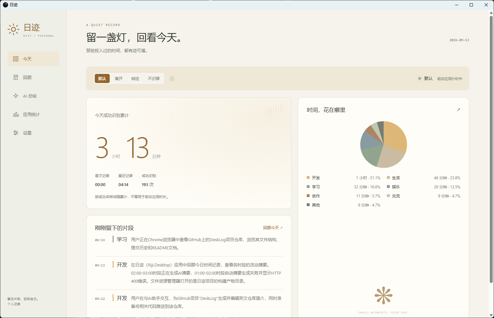
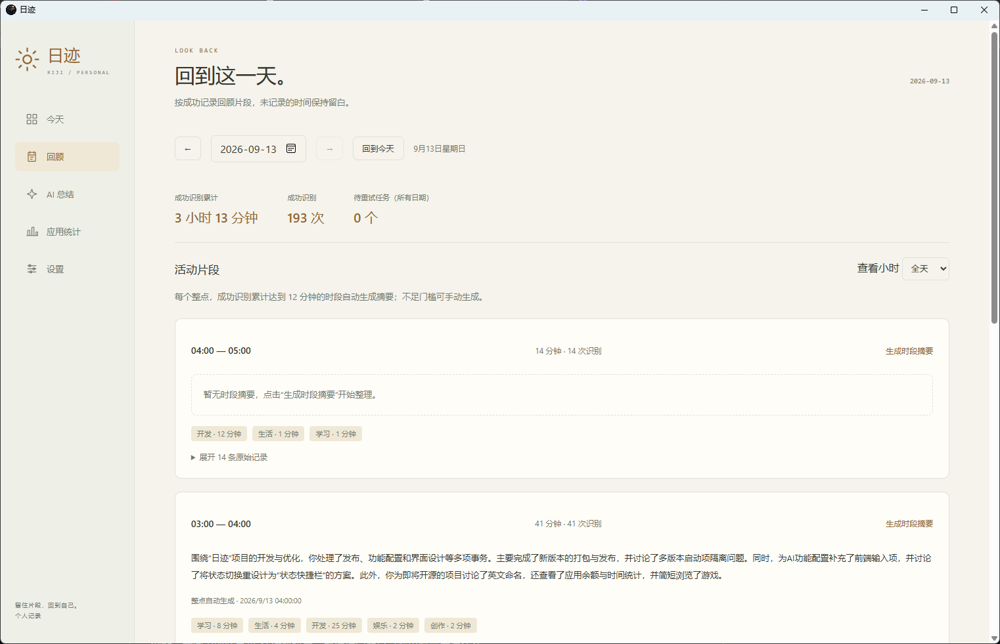

# 日迹 · DeskLog

日迹（DeskLog）是一款面向个人的 Windows 电脑活动记录与回顾工具。它记录前台应用使用时长，并可按设置记录网站、截图识别结果和 AI 时段摘要，帮助你回顾自己在电脑前做过什么。

当前版本为 `0.1.1`，应用界面为中文。

## 功能

- 记录前台应用使用时长和成功识别累计时长。
- 支持默认、离开、锁定、不识屏四种记录状态。
- 支持 Chrome、Edge、Firefox 浏览器的网站归属统计。
- 按天和小时回顾活动记录，支持手动和自动时段摘要。
- 支持自定义截图识别提示词、摘要提示词和活动分类。
- 数据保存在本机，支持备份、导入、升级备份和恢复。

AI 功能需要用户自行配置服务地址、模型和密钥。启用后，相关截图和活动记录会发送到指定服务。

## 界面展示





## 安装

下载 `DeskLog-Setup-v0.1.1.exe`，双击后选择安装目录。升级时会沿用已有安装目录，并要求先正常退出日迹。正式数据保存在 `%LOCALAPPDATA%\Riji\Production`。

## 浏览器扩展

安装目录的 `extensions` 文件夹中包含 Chrome / Edge 和 Firefox 的未打包扩展。`browser-extension` 目录支持开发加载；Firefox 开发版可先执行：

```powershell
node scripts/prepare-browser-extension.cjs firefox
```

扩展只向本机日迹服务发送当前前台网页的必要信息，不记录隐私窗口、浏览器内部页面、完整网址、网页正文或摘要片段。

## 开源许可

本项目使用 [MIT License](LICENSE)。第三方依赖的许可和版权声明见 [THIRD-PARTY-NOTICES.md](THIRD-PARTY-NOTICES.md)。
